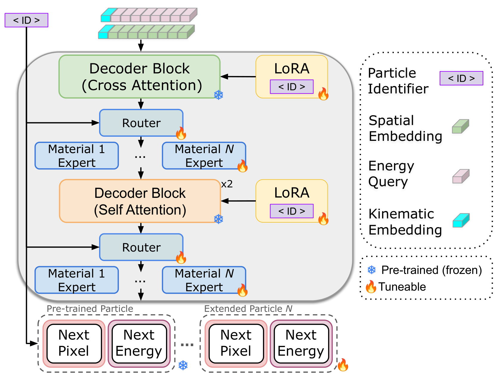
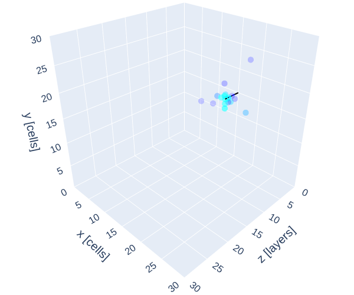
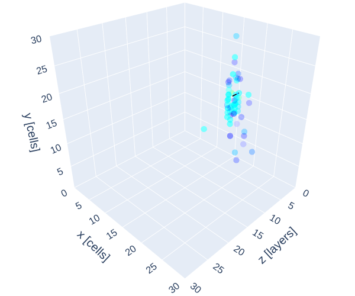
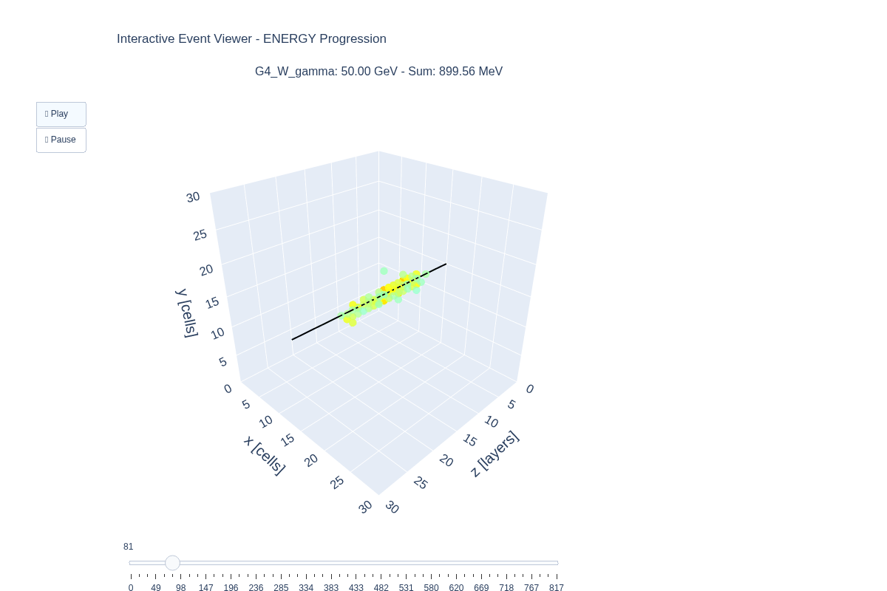
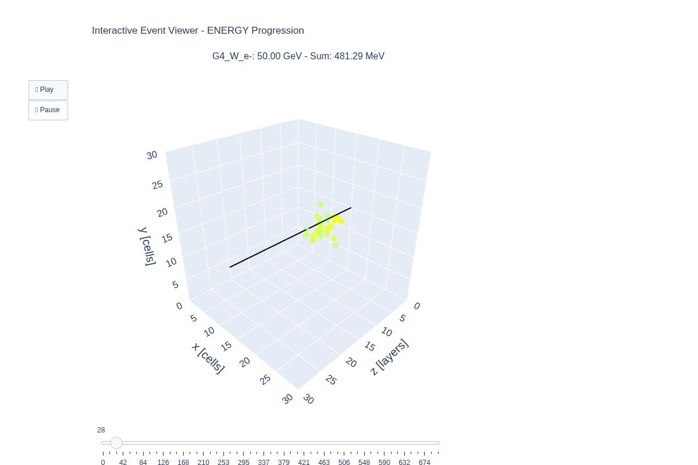

# [Scalable and Transferable Calorimeter Foundation Model via Mixtures-of-Experts and Parameter Efficient Fine Tuning](https://arxiv.org/abs/2505.08736)
---
## Abstract 
---

Modern particle physics experiments face an increasing demand for high-fidelity detector simulation as luminosities rise and computational requirements approach the limits of available resources. Deep generative models have emerged as promising surrogates for traditional Monte Carlo simulation, with recent advances drawing inspiration from large language models (LLM) and next-token prediction paradigms. In this work, we introduce a scalable and transferable calorimeter foundation model built on next-token transformer backbones, designed to support modular adaptation across materials, particle species, and detector configurations.

Our approach combines Mixture-of-Experts pre-training with parameter-efficient fine-tuning strategies to enable controlled, additive model expansion without catastrophic forgetting. A single pre-trained backbone is trained to generate electromagnetic showers across multiple absorber materials, while new materials are incorporated through the addition and tuning of lightweight expert modules. Extensions to new particle types are achieved via parameter-efficient fine-tuning and modular vocabularies, preserving the integrity of the base model. This design enables incremental knowledge integration as new simulation datasets become available, a critical requirement in realistic detector-development workflows.

We demonstrate that next-token calorimeter models are computationally competitive with standard generative approaches under established LLM optimization procedures, while offering strong fine-tuning efficiency. By amortizing CPU-intensive simulation through GPU-based generation and modular adaptation, the proposed foundation model paradigm enables a scalable and computationally sustainable detector optimization strategy. These results establish next-token architectures as a viable path toward extensible, physics-aware foundation models for calorimetry and future high-energy physics experiments.

## Contents

1. [Architecture](#architecture)
2. [Interactive Event Visualization](#interactive)
3. [Example Tokenization](#example-tokenization)
4. [Base Model Training](#training)
5. [Material Fine-Tuning](#material-fine-tuning)
6. [Particle Extension](#particle-extension)
7. [Inference](#inference)
8. [K-Fold Studies](#k-fold-studies)
9. [Environment](#environment)
10. [Dataset](#dataset)
11. [Pre-trained Weights](#weights)

---

# Architecture



The framework utilizes a core transformer backbone consisting of cross-attention and self-attention decoder blocks that remain frozen during secondary adaptation phases. Material extensibility is achieved through a Mixture-of-Experts (MoE) layer where a router directs inputs to specialized modules, allowing for the addition of new materials by fine-tuning only a singular new expert. When transitioning to different particle species, the model employs a parameter-efficient strategy using LoRA modules and expanded particle-specific vocabulary heads for pixel and energy prediction while the base photon model parameters remain static. For subsequent material expansion of an adapted model, a new expert is integrated while the previously tuned LoRA and vocabulary components are frozen to preserve the learned particle-specific features. The system is conditioned throughout these stages by a combination of spatial, kinematic, and energy query embeddings alongside a unique particle identifier.

# Interactive Event Visualization

Generated shower events can be visualized interactively with an animated 3D viewer. The viewer supports two animation modes:

## Z-Position Progression

Animate the shower development layer-by-layer through the detector:

```bash
python demo.py \
    --config config/config.json \
    --initial_energy 50.0 \
    --animated_viewer
```

This generates an HTML file in the `Animations/` folder showing voxels appearing progressively from z=0 to z=max.

| Photon | Electron |
|--------|----------|
|  |  |


## Energy-Ordered Progression

Animate the shower by adding hits from highest to lowest energy:

```bash
python demo.py \
    --config config/config.json \
    --initial_energy 50.0 \
    --animated_viewer
```

This generates an HTML file showing the full cube initially filled with a center line, then voxels are highlighted in order of decreasing energy. The slider displays the actual number of hits.

| Photon | Electron |
|--------|----------|
|  |  |

The raw .html files are available for download in the assets folder.

# Example Tokenization

Energy and space stem from independent vocabularies—since the mapping between space and energy is many-to-many, they are treated independently. The sequences are merged within the model and predicted from separate heads.

Where **I** = initial energy and **p/e** subscripts denote spatial/energy tokens:

**Spatial sequence:**  
`[I, SOS_p, p₁, p₂, ..., pₙ, EOS_p]`

**Energy sequence:**  
`[I, SOS_e, e₁, e₂, ..., eₙ, EOS_e]`

# Training

Multi-GPU training is supported via **torchrun** (limited to single node). Ensure your configuration file is properly structured. Datasets are organized as lists of files (stored in `.txt` files). You can generate this format with:

```bash
ls /datadir > photon_files.txt
```

Then train with:

```bash
torchrun --nproc-per-node=NUM_GPUS train_dist.py \
    --config config/config.json \
    --material_list "material_1" "material_2" "material_N"
```

# Material Fine-Tuning

Material fine-tuning (extension) adds a new expert module for each new material. Example command:

```bash
torchrun --nproc-per-node=NUM_GPUS fine_tune.py \
    --config config/config.json \
    --default_material_list "G4_W_gamma" "G4_Ta_gamma" \
    --material_to_add "G4_Pb_gamma" \
    --base_particle_list "gamma" \
    --closest_expert "G4_Ta_gamma" \
    --particle_type "gamma" \
    --fine_tune_path /path/to/base/model.pth 
```

# Particle Extension

Particle adaptation adds LoRA modules, an expert module, and particle-specific vocabulary heads. Set these config flags to `true`: `enable_head_LoRA`, `enable_vocab_LoRA`, and `learnable_vocabs`. Other adaptation strategies are available in the config. Example:

```bash
torchrun --nproc-per-node=NUM_GPUS fine_tune.py \
    --config config/config.json \
    --default_material_list "G4_W_gamma" "G4_Ta_gamma" "G4_Pb_gamma" \
    --material_to_add "G4_W_e-" \
    --base_particle_list "gamma" \
    --closest_expert "G4_W_gamma" \
    --particle_type "e-" \
    --fine_tune_path /path/to/material/fine/tuned/model.pth 
```

To further fine-tune a particle-adapted model to a new material:

```bash
torchrun --nproc-per-node=NUM_GPUS fine_tune.py \
    --config config/config.json \
    --default_material_list "G4_W_gamma" "G4_Ta_gamma" "G4_Pb_gamma" "G4_W_e-" \
    --material_to_add "G4_Ta_e-" \
    --base_particle_list "gamma" "e-" \
    --closest_expert "G4_W_e-" \
    --particle_type "e-" \
    --fine_tune_path /path/to/material/fine/tuned/model.pth 
```

**Note**: Base particle list and default material list can be set in the config file, but it's often more convenient to pass them as arguments. If new materials/particles require longer sequences, you **must** update `max_seq_length` in the config file for proper dataset structuring (this will be automated in future versions).


# Inference

Inference runs on single or multiple GPUs. Config specifies output file, but can be overridden via arguments. When comparing to ground truth, update `max_seq_length` in config (overestimation is harmless). Use **generate.py**:

```bash
python generate.py \
    --config config/config.json \
    --materials_to_generate "material_1" "material_N" \
    --gen_seq_len MAX_SEQ_LEN
```

Key arguments: `--dynamic_temp` (enable dynamic temperature scheduling), `--temperature TEMP` (sampling temperature), and `--disable_cudagraphs` (slower, but possibly more stable). See script for full details.

# K-Fold Studies

Here's an example script for k-fold fine-tuning studies. Originally designed for Kubernetes, but can be adapted for other environments (e.g., Slurm).

```bash
for RUN_NUM in {1..5}; do
            echo "=========================================="
            echo "Starting run $RUN_NUM / 5 (n_events=10000)"
            echo "=========================================="
            
            DATASET_SEED=$(date +%s%N | tail -c 10)
            torchrun --nproc-per-node=NUM_GPUS fine_tune.py \
              --config config/config.json \
              --default_material_list "G4_W_gamma" "G4_Ta_gamma" "G4_Pb_gamma" "G4_W_e-" "G4_Ta_e-" \
              --material_to_add "G4_Pb_e-" \
              --closest_expert "G4_Ta_e-" \
              --base_particle_list "gamma" "e-" \
              --particle_type "e-" \
              --n_events 10000 \
              --dataset_seed $DATASET_SEED \
              --fine_tune_path /path/to/fine/tuned/model.pth \
              > OutFile_G4_Pb_e-_10000Events_${RUN_NUM}.txt 2>&1
            
            CKPT_PATH=$(grep "FINAL_CHECKPOINT_PATH=" OutFile_G4_Pb_e-_10000Events_${RUN_NUM}.txt | tail -1 | cut -d'=' -f2)
    
            if [ -z "$CKPT_PATH" ]; then
              echo "Could not find FINAL_CHECKPOINT_PATH in logs"
              exit 1
            fi
            
            echo "================================================"
            echo "Using checkpoint for generation: $CKPT_PATH"
            echo "================================================"

            torchrun --nproc-per-node=NUM_GPUS generate_dist.py \
              --config config/config.json \
              --material_list "G4_W_gamma" "G4_Ta_gamma" "G4_Pb_gamma" "G4_W_e-" "G4_Ta_e-" "G4_Pb_e-" \
              --particle_list "gamma" "e-" \
              --output_file "G4_Pb_e-_10000Events_${RUN_NUM}.h5" \
              --inference_only \
              --model_path "$CKPT_PATH" \
              --dynamic_temp \
              --materials_to_generate "G4_Pb_e-" \
              --gen_seq_len 2700 \
              >> OutFile_G4_Pb_e-_10000Events_${RUN_NUM}.txt 2>&1
            # Check exit code
            if [ $? -ne 0 ]; then
              echo "Generation failed for run $RUN_NUM! Check logs:"
              echo "OutFile_G4_Pb_e-_10000Events_${RUN_NUM}.txt"
              exit 1
            fi

            echo "Completed run $RUN_NUM / 5"
            echo "=========================================="
            echo ""
          done
```

# Environment

Key requirements: 

- Python:     3.12.8
- Pytorch:    2.5.1
- CUDA:       12.4

The dependencies for the networks can be installed with the following command:

```bash
conda env create -f env.yml
```

In the case that some packages do not install through the provided conda command, you can install them using pip once your conda environment is activated:

```bash
python3 -m pip install <package>
```

# Dataset

Datasets can be reproduced following the instructions at [github.com/FLC-QU-hep/getting_high](https://github.com/FLC-QU-hep/getting_high). Additional information on detector material modifications is available upon request.

# Pre-trained Weights

Download manually from the [Google Drive link](https://drive.google.com/file/d/1yCICuNOSbc8MN_c5N61zdswTEUGF9uSX/view?usp=sharing). The first time you download, Google Drive may prompt with a virus scan warning. If you get a "quota exceeded" error, try again later.

```json
{
    "model_path": "./pretrained.pth",
    ...
}
```
